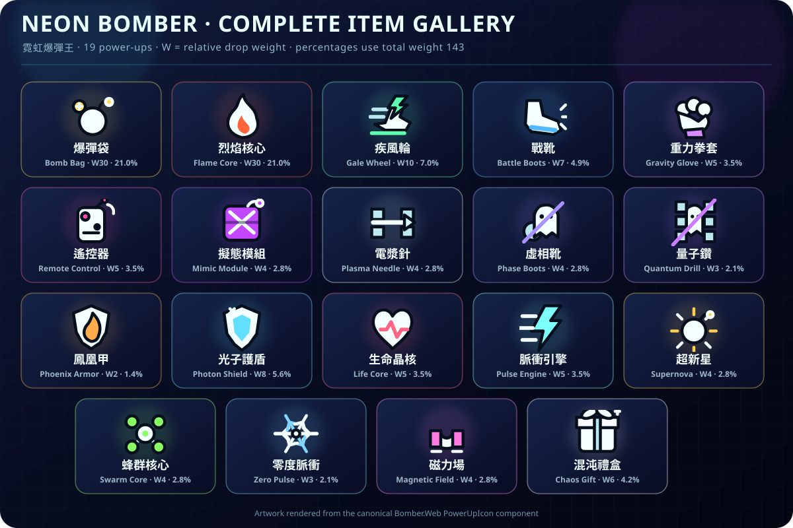

# Neon Bomber / 霓虹爆彈王

This repository contains two editions of the same local multiplayer arena game:

- [`html/`](html/) — the dependency-free browser edition. Open `html/index.html` directly or serve the folder with any static file server.
- [`dotnet/`](dotnet/) — the .NET 10 / Blazor WebAssembly edition. Its arena state, rules, weighted drops, fixed-step simulation, and AI run in C#.

## Highlights

- Two-to-four-player local keyboard multiplayer with configurable AI opponents
- Obstacle-aware blast previews, weighted power-ups, kicking, throwing, remote bombs, and piercing flames
- Eliminated players return as ghosts and can fight for a revival
- Deterministic fixed-step C# simulation with engine, regression, performance, and soak tests
- Fully local play with no account, backend, telemetry, or network gameplay dependency

## Requirements

The HTML edition needs only a modern desktop browser. The .NET edition requires the .NET 10 SDK. PowerShell 7 and Microsoft Edge are required only for the optional Windows Start Menu launcher.

## Run the .NET edition

```powershell
dotnet run --project .\dotnet\src\Bomber.Web\Bomber.Web.csproj
```

Open the local URL printed by `dotnet run`. Blazor WebAssembly must be served over HTTP; it cannot be started by double-clicking its generated `index.html`.

On Windows, the optional **Neon Bomber (.NET)** Start Menu shortcut targets a small native launcher with the neon-bomb icon embedded. It runs [`Start-NeonBomber.ps1`](dotnet/Start-NeonBomber.ps1), launches the local .NET host invisibly, and opens the game in a dedicated Edge profile using true F11-equivalent fullscreen mode. Press `F11` to leave or re-enter fullscreen, or `Alt+F4` to close the game. The launcher reuses an existing host when one is already running. Build or reinstall that shortcut with:

```powershell
.\dotnet\Install-StartMenuShortcut.ps1
```

Build and test everything with:

```powershell
dotnet build .\dotnet\Bomber.slnx -c Release
dotnet test .\dotnet\Bomber.slnx -c Release
```

The .NET edition automatically remembers all main-menu choices—player names, human/AI/off slots, AI difficulties, crown target, crate density, and item-drop rate—in that browser profile. Invalid or incompatible saved settings safely fall back to the built-in defaults.

## Controls

| Player | Move | Bomb | Action |
| --- | --- | --- | --- |
| 1 | `W A S D` | `Q` | `E` |
| 2 | `U H J K` | `Y` | `I` |
| 3 | Arrow keys | `Page Up` | `Page Down` |
| 4 (.NET) | Numpad `8 4 5 6` | Numpad `0` | Numpad decimal |

Press `Esc` to pause.

## Bomb timing and previews

Standard and ghost bombs detonate after about `1.9` seconds in both editions. Every grounded bomb draws its current, obstacle-aware flame footprint before it explodes; the preview follows moved bombs and accounts for solid walls, crates, piercing flames, mega range, cluster scatter, and chain targets. Remote-control bombs keep their longer safety fuse and can be triggered with the action key.

When several players overlap the placement tile, every overlapping player may leave the new bomb. The exemption ends independently once each player's full collision box clears the tile, so nobody is trapped by another player's placement and nobody can re-enter through the bomb afterward.

## Movement and cornering

A wall or bomb stops a player head-on, but a corner no longer catches the trailing half of the character after their center has cleared it. If a human requests a perpendicular turn a little early, the game briefly buffers that input, carries the current heading to the adjacent lane's centerline, and then spends the remaining movement on the turn. Releasing or changing the input cancels the buffer, so a stale facing direction never moves a stationary player.

## Item gallery



`W` is the item's relative weight inside the item pool, whose total weight is `143`. The percentage shown is conditional on an item actually dropping: arena loot settings first decide whether a destroyed energy crate produces a chip at all. Loose chips can be destroyed by flames.

Bomb-capacity and fire-range chips both have weight `30`. The next-highest item has weight `10`, so each priority upgrade is three times as likely as any other single item. Each represents about `21.0%` of item drops (`42.0%` combined).

## Comprehensive item guide

Unless noted otherwise, an upgrade lasts for the current round and resets when the next round begins. A player who becomes a ghost keeps every relevant upgrade and charge: range, bomb capacity, movement speed, remote control, piercing, disguise, dash, mega, cluster, and similar effects continue to influence ghost movement or ghost bombs. A successful ghost revival also retains those round-scoped upgrades.

### Core and equipment upgrades

| Item | Drop share | Effect and limits |
| --- | ---: | --- |
| **爆彈袋 / Bomb Bag** (`bomb`) | W30 · 21.0% | Adds `1` concurrent bomb, up to `9`. The same capacity controls how many ghost bombs may be active at once. |
| **烈焰核心 / Flame Core** (`fire`) | W30 · 21.0% | Adds `1` tile of flame range, up to `10`. It also extends ghost bombs; a charged Supernova can temporarily reach two tiles beyond the normal cap. |
| **疾風輪 / Gale Wheel** (`speed`) | W10 · 7.0% | Adds `0.34` movement speed, from a base of `3.15` up to `5.20`. Ghost rail speed scales with the collected speed upgrades. |
| **戰靴 / Battle Boots** (`kick`) | W7 · 4.9% | Passive equipment. Moving into a bomb pushes or kicks it forward when the next tile is open. Unlike the Gravity Glove, no action-key press is needed. |
| **重力拳套 / Gravity Glove** (`glove`) | W5 · 3.5% | Action-key equipment. Throws the adjacent bomb in the facing direction across several open cells. It works on bombs regardless of owner. |
| **遙控器 / Remote Control** (`remote`) | W5 · 3.5% | Newly placed regular and ghost bombs receive a long `8`-second safety fuse. The action key detonates the oldest grounded bomb you own; remote detonation takes priority over glove or dash actions when a valid bomb exists. |
| **擬態模組 / Mimic Module** (`disguise`) | W4 · 2.8% | Bombs placed after pickup look like energy crates for the rest of the round. Their collision, fuse, chain reactions, and damage remain normal, and the flame-range preview stays visible for fairness. |
| **電漿針 / Plasma Needle** (`pierce`) | W4 · 2.8% | Each flame ray may pass through one energy crate and continue beyond it. A second crate on the same ray still stops the flame. |
| **虛相靴 / Phase Boots** (`bombpass`) | W4 · 2.8% | Allows movement through stationary bombs. It does not grant immunity to their flames. |
| **量子鑽 / Quantum Drill** (`wallpass`) | W3 · 2.1% | Allows movement through destructible energy crates, but never through the arena's solid walls. |
| **鳳凰甲 / Phoenix Armor** (`flamepass`) | W2 · 1.4% | Permanently protects you from flames created by your own bombs for the rest of the round. Enemy flames still cause normal damage, so the armor cannot erase every hazard. |
| **磁力場 / Magnetic Field** (`magnet`) | W4 · 2.8% | Smoothly attracts loose chips from roughly `2.5` tiles away. Nearby magnet owners may compete for the same chip; attracted items remain vulnerable to flames until collected. |

### Protection and charged powers

| Item | Drop share | Effect and limits |
| --- | ---: | --- |
| **光子護盾 / Photon Shield** (`shield`) | W8 · 5.6% | Adds one shield charge, up to `3`. A charge absorbs the next flame hit and grants a short recovery window. |
| **生命晶核 / Life Core** (`heart`) | W5 · 3.5% | Restores or adds one current life, up to `3`. Damage consumes life after shields; a ghost revival returns with one life. |
| **脈衝引擎 / Pulse Engine** (`dash`) | W5 · 3.5% | Adds `2` dash charges, up to `5`. The action key consumes one charge for a brief high-speed burst; ghosts can spend retained charges to race around the outer rail. |
| **超新星 / Supernova** (`mega`) | W4 · 2.8% | Adds one charge, up to `3`. The next regular or ghost bomb consumes one charge, becomes visually larger, gains `2` flame-range tiles, and produces a stronger, longer blast presentation. |
| **蜂群核心 / Swarm Core** (`cluster`) | W4 · 2.8% | Adds one charge, up to `3`. The next regular or ghost bomb consumes one charge and scatters short diagonal flames from selected blast endpoints. |

### Immediate and unpredictable items

| Item | Drop share | Effect and limits |
| --- | ---: | --- |
| **零度脈衝 / Zero Pulse** (`freeze`) | W3 · 2.1% | Triggers immediately and freezes every living opponent for `2.2` seconds. It does not freeze the collector or ghosts already outside the arena. |
| **混沌禮盒 / Chaos Gift** (`mystery`) | W6 · 4.2% | Resolves immediately into one of six outcomes listed below. It can be a major upgrade, a repositioning tool, or a six-second curse. |

#### Chaos Gift outcomes

| Chance | Outcome |
| ---: | --- |
| 20% | **Direction reversal** — reverses movement controls for `6` seconds. |
| 18% | **Slime slowdown** — reduces movement speed for `6` seconds. |
| 17% | **Quantum teleport** — moves the collector to a random open, bomb-free floor cell and grants about `1` second of protection. |
| 17% | **Double shield** — adds `2` shield charges. |
| 16% | **Destruction package** — adds `2` Supernova charges and `1` Swarm Core charge. |
| 12% | **Full overload** — adds `2` bomb capacity, `2` flame range, and `0.50` movement speed, subject to the normal stat caps. |

## Project map

```text
html/
  index.html
  css/                 layout, lobby, overlays, responsive rules
  js/                  config/UI, audio, game state, AI, simulation, rendering
  assets/              local image, audio, and favicon files

dotnet/
  src/Bomber.Core/     deterministic C# game engine and AI
  src/Bomber.Launcher/ icon-bearing native Windows launcher
  src/Bomber.Web/      Blazor WebAssembly UI and SVG arena renderer
  tests/               engine tests
  tools/               reproducible icon asset builder

docs/
  item-gallery.svg     README gallery rendered from the canonical .NET item icons
```

The neon bomb application icon is shared by both editions. The HTML edition's bundled Kenney media is attributed in its in-game help panel.

## Licensing

Third-party asset terms are recorded in [`THIRD_PARTY_NOTICES.md`](THIRD_PARTY_NOTICES.md). No project-wide source or artwork license is currently granted; public repository visibility alone does not grant reuse rights.
