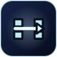

# Neon Bomber／霓虹爆彈王

本儲存庫收錄同一款本機多人競技遊戲的兩個版本：

- [`html/`](html/) — 無相依套件的瀏覽器版。可直接開啟 `html/index.html`，或以任何靜態檔案伺服器提供此資料夾。
- [`dotnet/`](dotnet/) — 使用 .NET 10 與 Blazor WebAssembly 的版本。競技場狀態、規則、加權掉落、固定步長模擬與 AI 均由 C# 執行。

## 遊戲特色

- 支援 2–4 位玩家共用鍵盤，並可為每個席位設定 AI 對手
- 具備會考慮障礙物的爆風預覽、加權道具、踢彈、拋彈、遙控爆破與貫穿火焰
- 出局玩家會化為幽靈，並能靠擊倒對手爭取復活
- 採用可重現的固定步長 C# 模擬，附有引擎、回歸、效能與長時間模擬測試
- 完全在本機執行，不需帳號、後端、遙測或網路連線對戰

## 系統需求

HTML 版只需要現代桌面瀏覽器。.NET 版需要 .NET 10 SDK。只有選用 Windows「開始」功能表啟動器時，才需要 PowerShell 7 與 Microsoft Edge。

## 啟動 .NET 版

```powershell
dotnet run --project .\dotnet\src\Bomber.Web\Bomber.Web.csproj
```

開啟 `dotnet run` 顯示的本機網址。Blazor WebAssembly 必須透過 HTTP 提供，無法直接雙擊建置後的 `index.html` 啟動。

在 Windows 上，選用的「開始」功能表捷徑 **Neon Bomber (.NET)** 會啟動內嵌霓虹爆彈圖示的原生啟動器。它會執行 [`Start-NeonBomber.ps1`](dotnet/Start-NeonBomber.ps1)、在背景啟動本機 .NET 主機，並以專用 Edge 設定檔開啟真正的全螢幕模式。按 `F11` 可離開或再次進入全螢幕，按 `Alt+F4` 可關閉遊戲。若主機已在執行，啟動器會直接沿用。可用下列指令建置或重新安裝捷徑：

```powershell
.\dotnet\Install-StartMenuShortcut.ps1
```

建置並測試整個專案：

```powershell
dotnet build .\dotnet\Bomber.slnx -c Release
dotnet test .\dotnet\Bomber.slnx -c Release
```

.NET 版會在該瀏覽器設定檔中自動保存主選單的所有設定，包括玩家名稱、真人／AI／關閉席位、AI 難度、皇冠目標、能量箱密度與道具掉落率。若保存資料無效或與新版不相容，遊戲會安全地改用內建預設值。

## 操作方式

| 玩家 | 移動 | 放置爆彈 | 使用能力 |
| --- | --- | --- | --- |
| 1 | `W A S D` | `Q` | `E` |
| 2 | `U H J K` | `Y` | `I` |
| 3 | 方向鍵 | `Page Up` | `Page Down` |
| 4（.NET） | 數字鍵盤 `8 4 5 6` | 數字鍵盤 `0` | 數字鍵盤小數點 |

按 `Esc` 可暫停遊戲。

## 爆彈計時與爆風預覽

兩個版本的標準爆彈與幽靈爆彈都會在約 `1.9` 秒後引爆。每枚落地爆彈在爆炸前都會顯示目前的爆風範圍；預覽會隨被移動的爆彈更新，並考慮實心牆、能量箱、貫穿火焰、超新星範圍、蜂群散射與連鎖引爆目標。遙控爆彈具有較長的安全引信，可用能力鍵主動引爆。

若多名玩家重疊在放置格上，每位重疊玩家都能離開新爆彈。當各玩家的完整碰撞框分別離開該格後，通行豁免便各自結束；因此其他玩家不會被放彈者困住，也無法在離開後再次穿回爆彈。

## 移動與轉彎

正面撞上牆壁或爆彈時仍會停止，但當角色中心已越過牆角，尾端半身不會再被角落勾住。真人玩家若稍早按下垂直於目前方向的轉彎鍵，遊戲會短暫緩衝該輸入，先沿目前方向自動移至相鄰通道的中心線，再用剩餘移動距離完成轉彎。放開或改變輸入會取消緩衝，因此角色靜止時不會因舊的面向自行移動。

## 完整道具指南

下表的 `W` 是道具池中的相對掉落權重，總權重為 `143`。百分比表示「已確定掉落道具」時抽中該道具的機率；能量箱掉落率設定會先決定被摧毀的能量箱是否產生晶片。地面上的晶片會被火焰摧毀。

爆彈數量與爆風範圍晶片的權重皆為 `30`，而下一高的單一道具權重為 `10`。因此兩種優先強化各自是其他任一最高權重道具的三倍，分別約占所有道具掉落的 `21.0%`，合計約 `42.0%`。

除非另有說明，強化效果會維持到本回合結束，並在下一回合開始時重設。玩家化為幽靈後會保留所有適用的強化與充能，包括爆風範圍、爆彈數量、移動速度、遙控、貫穿、擬態、衝刺、超新星與蜂群等效果；幽靈成功復活後也會保留這些本回合強化。

### 核心強化與永久裝備

| 圖示 | 道具 | 掉落占比 | 效果與上限 |
| :---: | --- | ---: | --- |
|  | **爆彈袋** (`bomb`) | W30 · 21.0% | 可同時放置的爆彈數量增加 `1`，最多 `9` 枚；此容量也會限制同時存在的幽靈爆彈數量。 |
|  | **烈焰核心** (`fire`) | W30 · 21.0% | 爆風範圍增加 `1` 格，最多 `10` 格；幽靈爆彈也會延伸。充能後的超新星可暫時超出一般上限 `2` 格。 |
|  | **疾風輪** (`speed`) | W10 · 7.0% | 移動速度增加 `0.34`，由基礎值 `3.15` 提升，最高 `5.20`；幽靈在外圍軌道的速度也會隨此強化提升。 |
|  | **戰靴** (`kick`) | W7 · 4.9% | 被動裝備。朝爆彈移動時，若下一格暢通便會將爆彈向前推動或踢出；與重力拳套不同，不需按能力鍵。 |
|  | **重力拳套** (`glove`) | W5 · 3.5% | 主動裝備。按能力鍵可將面向方向的相鄰爆彈拋過數個暢通格，不受爆彈擁有者限制。 |
|  | **遙控器** (`remote`) | W5 · 3.5% | 此後放置的一般爆彈與幽靈爆彈會取得較長的 `8` 秒安全引信。能力鍵會引爆自己最早落地的爆彈；有可引爆目標時，遙控操作優先於拳套或衝刺。 |
|  | **擬態模組** (`disguise`) | W4 · 2.8% | 拾取後放置的爆彈在本回合會偽裝成能量箱，但碰撞、引信、連鎖反應與傷害維持不變，且仍顯示爆風預覽以確保公平。 |
|  | **電漿針** (`pierce`) | W4 · 2.8% | 每道爆風可貫穿一個能量箱並繼續延伸；同一方向遇到第二個能量箱時仍會停止。 |
|  | **虛相靴** (`bombpass`) | W4 · 2.8% | 可穿過靜止的爆彈，但不會免疫其爆風。 |
|  | **量子鑽** (`wallpass`) | W3 · 2.1% | 可穿過可摧毀的能量箱，但永遠無法穿過競技場的實心牆。 |
|  | **鳳凰甲** (`flamepass`) | W2 · 1.4% | 本回合永久免疫自己爆彈產生的火焰；敵方火焰仍會造成正常傷害，因此無法消除所有危險。 |
|  | **磁力場** (`magnet`) | W4 · 2.8% | 平順吸引約 `2.5` 格內的地面晶片。鄰近的磁力場持有者可能爭奪同一晶片；晶片在被拾取前仍會遭火焰摧毀。 |

### 防護與充能能力

| 圖示 | 道具 | 掉落占比 | 效果與上限 |
| :---: | --- | ---: | --- |
|  | **光子護盾** (`shield`) | W8 · 5.6% | 增加 `1` 次護盾，最多 `3` 次。護盾可吸收下一次火焰傷害，並提供短暫的恢復時間。 |
|  | **生命晶核** (`heart`) | W5 · 3.5% | 恢復或增加 `1` 顆目前生命，最多 `3` 顆。護盾耗盡後，受傷會扣除生命；幽靈復活時會以 `1` 顆生命回歸。 |
|  | **脈衝引擎** (`dash`) | W5 · 3.5% | 增加 `2` 次衝刺充能，最多 `5` 次。能力鍵會消耗一次充能並短暫高速衝刺；幽靈也能消耗保留的充能，在外圍軌道高速移動。 |
|  | **超新星** (`mega`) | W4 · 2.8% | 增加一次充能，最多 `3` 次。下一枚一般或幽靈爆彈會消耗一次充能，外觀變大、爆風範圍增加 `2` 格，並呈現更強烈且更持久的爆炸效果。 |
|  | **蜂群核心** (`cluster`) | W4 · 2.8% | 增加一次充能，最多 `3` 次。下一枚一般或幽靈爆彈會消耗一次充能，並從部分爆風末端散射短距離斜向火焰。 |

### 立即生效與隨機道具

| 圖示 | 道具 | 掉落占比 | 效果與上限 |
| :---: | --- | ---: | --- |
|  | **零度脈衝** (`freeze`) | W3 · 2.1% | 拾取後立即生效，使所有仍存活的對手凍結 `2.2` 秒；不會凍結拾取者，也不影響已在競技場外的幽靈。 |
|  | **混沌禮盒** (`mystery`) | W6 · 4.2% | 拾取後立即抽出下列六種結果之一，可能獲得大幅強化、重新定位，或承受六秒詛咒。 |

#### 混沌禮盒結果

| 機率 | 結果 |
| ---: | --- |
| 20% | **方向反轉** — 移動控制反轉 `6` 秒。 |
| 18% | **黏液減速** — 移動速度降低 `6` 秒。 |
| 17% | **量子傳送** — 將拾取者移至隨機、暢通且沒有爆彈的地板格，並提供約 `1` 秒保護。 |
| 17% | **雙重護盾** — 增加 `2` 次護盾。 |
| 16% | **毀滅套餐** — 增加 `2` 次超新星充能與 `1` 次蜂群核心充能。 |
| 12% | **全面超載** — 爆彈容量增加 `2`、爆風範圍增加 `2`、移動速度增加 `0.50`，並受一般屬性上限限制。 |

## 專案結構

```text
html/
  index.html
  css/                 版面、大廳、覆蓋視窗與響應式規則
  js/                  設定／介面、音效、遊戲狀態、AI、模擬與繪製
  assets/              本機圖片、音效與網站圖示

dotnet/
  src/Bomber.Core/     可重現的 C# 遊戲引擎與 AI
  src/Bomber.Launcher/ 內嵌應用程式圖示的原生 Windows 啟動器
  src/Bomber.Web/      Blazor WebAssembly 介面與 SVG 競技場繪製
  tests/               引擎測試
  tools/               可重現的圖示資產建置工具

docs/
  items/               README 道具指南使用的 19 張獨立 SVG 圖示
```

兩個版本共用同一款霓虹爆彈應用程式圖示。HTML 版所附的 Kenney 媒體素材已在遊戲內的說明面板中標示出處。

## 授權

第三方素材條款記錄於 [`THIRD_PARTY_NOTICES.md`](THIRD_PARTY_NOTICES.md)。本專案目前未授予整體原始碼或美術素材的使用授權；儲存庫設為公開並不代表允許再利用。
